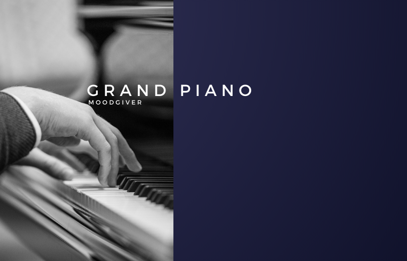

# Grand Piano Version: 0.0.1

Date: 26 April 2024

By: Moodgiver - Antonio Nardone

## The Story
Grand Piano is a simple instrument which is focused on the sound quality. 
It's quite light due to the good samples quality with a very low load of the CPU
Based on high quality samples and working hardly on the correct mapping the goal was to create a simple Grand Piano with a good sound.
Grand Piano samples are quite difficult to manipulate, to set the correct loop points (cross-zero): this was the most difficult part.
Working hard prevents to set round-robin environment always difficult to arrange and set correctly.
Key ranges are from A-1 to C7. Added also Reverb control in order to simulate different ambience depending on your needs.

## Using the instrument

Tone: 
- default value 850 for a clear
- over 1000 to simulate open and a little crystal sound
- below 850 to simulate sordina
- key ranges: A-1 - C7

## Included formats

- Decent Sampler

## Release notes
First release. For any problem open an issue on this repo.
### New

### Bugfixes

